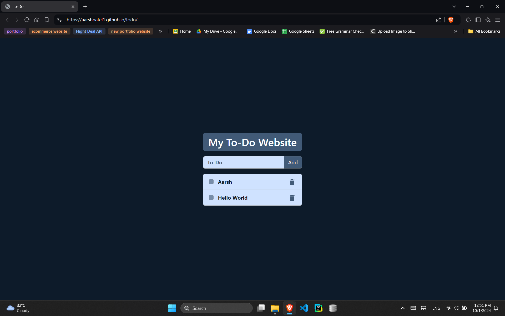
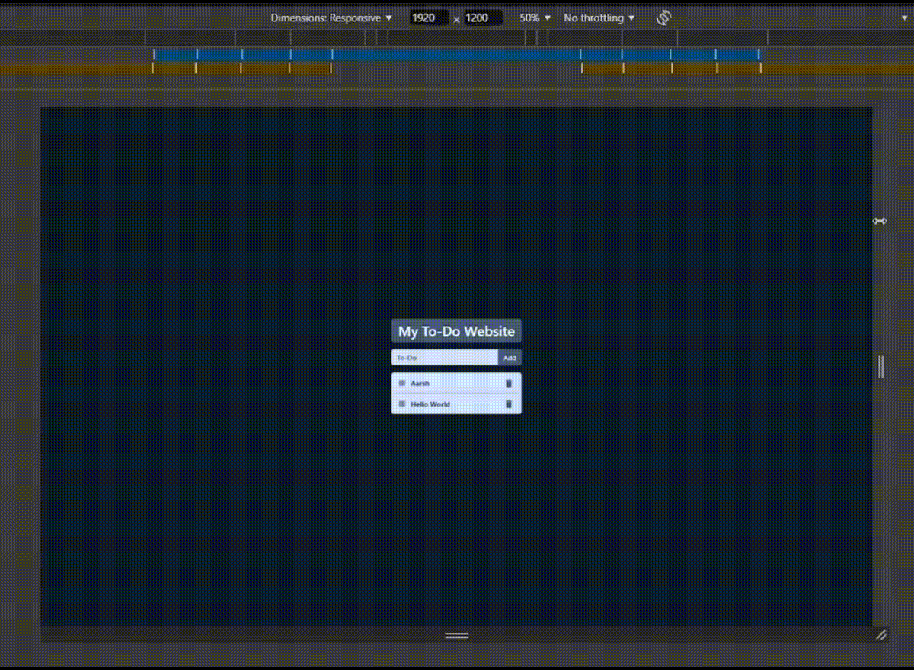
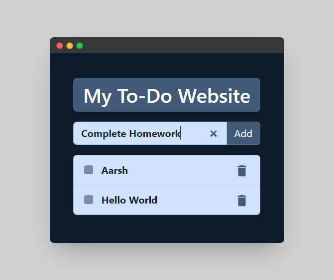

# To-Do App

A simple and efficient To-Do application that allows users to create, organize, and manage tasks. This app includes features such as drag-and-drop sorting, local storage to save tasks, and a responsive user interface for optimal experience across devices.

<!--  -->

## Features

### 1. **Drag-and-Drop Sorting**
   - Easily reorder your tasks by dragging and dropping them into the desired position.
   - Simple and intuitive UI makes task management easy.
   <!-- -->

### 2. **Local Storage Support**
   - Tasks are stored locally in your browser, so you don't lose your to-do list even after refreshing or closing the browser.
   - The application automatically saves the current state, ensuring your list is always up to date.

### 3. **Responsive UI**
   - Fully responsive design to ensure a seamless experience across all devices, including desktops, tablets, and mobile phones.
   <!-- -->

## How to Use

1. Add a new task by typing in the input field and pressing Enter.
2. Reorder tasks by clicking and dragging them.
3. Your tasks will be automatically saved in the browser's local storage.
4. Delete a task by clicking on the delete icon next to each task.

## Technologies Used

- HTML5
- CSS3
- JavaScript (jQuery)
- Local Storage API

## Getting Started

### Clone the repository
```bash
git clone https://github.com/aarshpatel1/todo.git
```

### Open in browser
Open the `index.html` file in any modern browser.

## Demo

Check out the live demo of the app [here](https://aarshpatel1.github.io/todo/).



## Screenshots

Add screenshots here to showcase different features of the app.

1. **Task Creation**
   <!-- -->
   
2. **Drag-and-Drop Sorting**
   <!-- -->
   
3. **Responsive UI**
   <!-- -->

## Videos

You can also showcase the core functionalities through demo videos.

1. **Task Sorting Video**
   <!-- -->
   
2. **Mobile Responsiveness Demo**
   <!--  -->

## Contributing

Feel free to submit issues or pull requests to improve the app!

---
